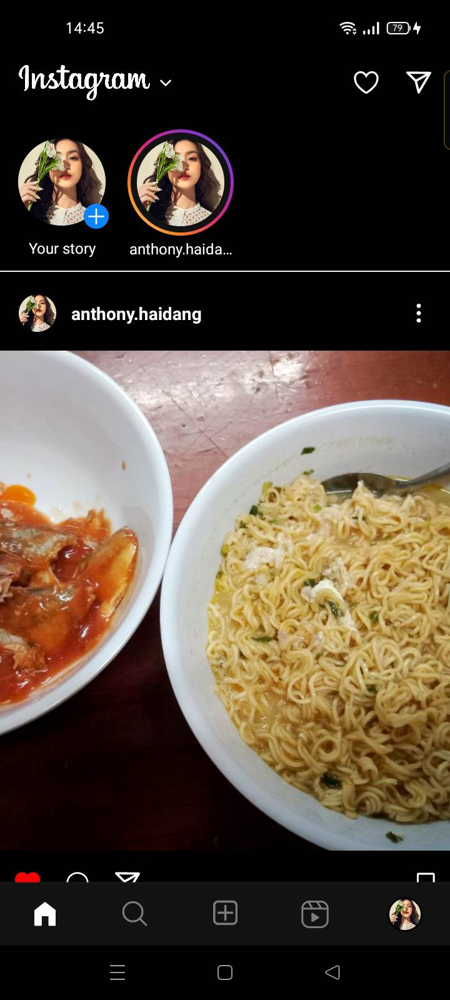

# Instagram Clone - Android App

Instagram clone is a self-hosted clone app of Instagram from Meta.  
Unlike other services, Instagram is free and open source.

Instagram is available on the Github.

  

## About

Instagram has been made from the official Instagram app from Meta.

This android application allows you to experience the same as the real application using React Native

This application was originally created by Anthony Hai (Front-end, UX/UI Developer) , Khuong Duy (Back-end, ASP.NET Developer), Anh Nguyet (Business Logic Analysis, ERD,...).

## Features

The android app lets you:

- Login - register with email and password must contain uppercase letters, lowercase letters, numbers, special characters.
- Personal page includes display information: avatar, number of posts, number of followers, posts arranged in chronological order.
- The feature to follow friends through "Button Follow".
- Create a new post: Select a photo or a group of photos before posting, then write the post status via icons and paragraphs.
- The new posts page created after each page reload includes the posts of the poster and the people who have followed the post.
- Real-time messaging: when a stranger or friend sends a message to. Users will receive when a notification appears in the message section. Choose a dark or light background theme.
- Take a photo and edit it instantly when you want to post a new article.
- Needs no special permissions on Android 11.0+.

## Screenshots

## Permissions

On Android versions prior to Android 11.0, Instagram requires the following permissions:

- Full Network Access.
- Read and write access to external storage.
- Permission for Camera and Audio Recording.

## Contributing

Instagram app is a free and open source project developed by students at university. Any contributions are welcome. Here are a few ways you can help:

- [Report bugs and make suggestions.](https://github.com/khuongduy172/Instagram/issues)
- [Write some code. Please follow the code style used in the project to make a review process faster.](https://github.com/khuongduy172/Instagram/pulls).

## License

This application is clone of official Instagram from Meta. Some of the used libraries are released under different licenses. Project is used for study purpose only.
